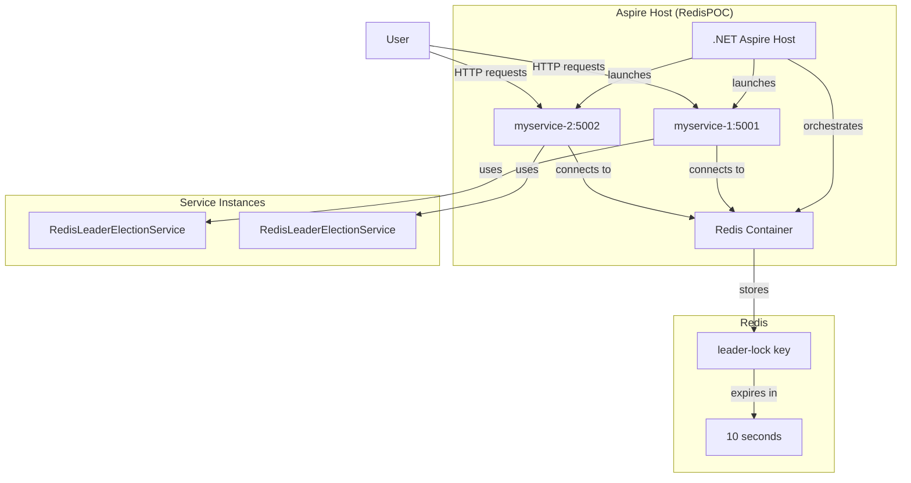
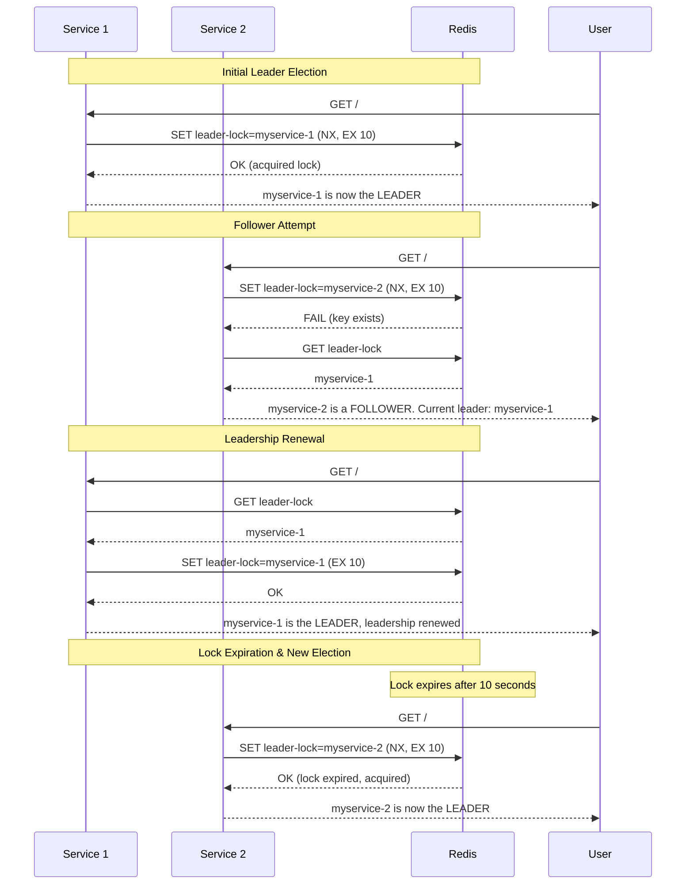

# Redis Leader Election with .NET Aspire

This project demonstrates a simple leader election pattern using Redis and .NET Aspire. It consists of a .NET Aspire host that orchestrates two instances of a web service. These services compete to become the "leader" by acquiring a lock in Redis.

## Architecture



## Project Structure

-   **RedisPOC**: The .NET Aspire application host. It configures and launches the Redis cache and the service instances.
-   **WebApplication1**: A minimal web API with a single endpoint. Each instance of this service uses a `RedisLeaderElectionService` to participate in the election.

## How it Works

The leader election is implemented using a simple locking mechanism in Redis.



1.  **Acquiring Leadership**: A service instance attempts to set a specific key (`leader-lock`) in Redis with its own unique instance ID. This operation is set to only succeed if the key does not already exist (`When.NotExists`). The key is created with a short expiry time (e.g., 10 seconds). The first instance to successfully set the key becomes the leader.

2.  **Maintaining Leadership**: The leader instance must periodically renew its lock by resetting the expiry time on the key. This is done on each request to its endpoint. If the leader fails to renew the lock (e.g., it crashes or becomes unresponsive), the lock expires.

3.  **Electing a New Leader**: Once the lock expires, other service instances (followers) can attempt to acquire it. The first one to succeed becomes the new leader.

## How to Run

1.  Make sure you have the .NET 8 SDK and Docker installed.
2.  Open a terminal in the root of the repository.
3.  Navigate to the `RedisPOC` directory:
    ```sh
    cd RedisPOC
    ```
4.  Run the application:
    ```sh
    dotnet run
    ```
5.  The .NET Aspire dashboard will launch in your browser. You will see the `redis` container and two service instances: `myservice-1` and `myservice-2`.

## How to Test

1.  In the Aspire dashboard, find the endpoint URLs for `myservice-1` and `myservice-2`. They will be something like `http://localhost:5001` and `http://localhost:5002`.

2.  Open two browser tabs or use a tool like `curl` to make requests to the root endpoint (`/`) of both services.

3.  **Initial State**: The first service you hit will likely become the leader.
    -   Request to `http://localhost:5001`:
        > `myservice-1 is now the LEADER`
    -   Request to `http://localhost:5002`:
        > `myservice-2 is a FOLLOWER. Current leader: myservice-1`

4.  **Leadership Renewal**: Keep refreshing the endpoint for the leader (`myservice-1`). You will see it renewing its leadership.
    > `myservice-1 is the LEADER, leadership renewed.`

5.  **Failover**: Stop the `RedisPOC` application. Wait for more than 10 seconds for the Redis lock to expire. Then, restart the application and hit the endpoint for `myservice-2` first. It should now become the leader.
